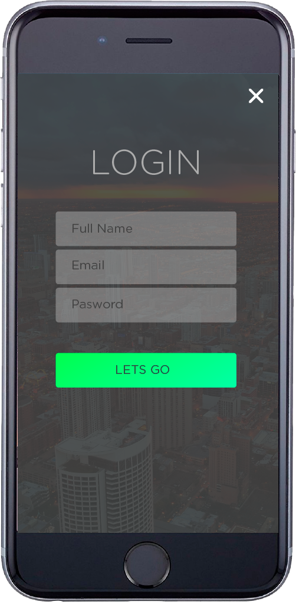
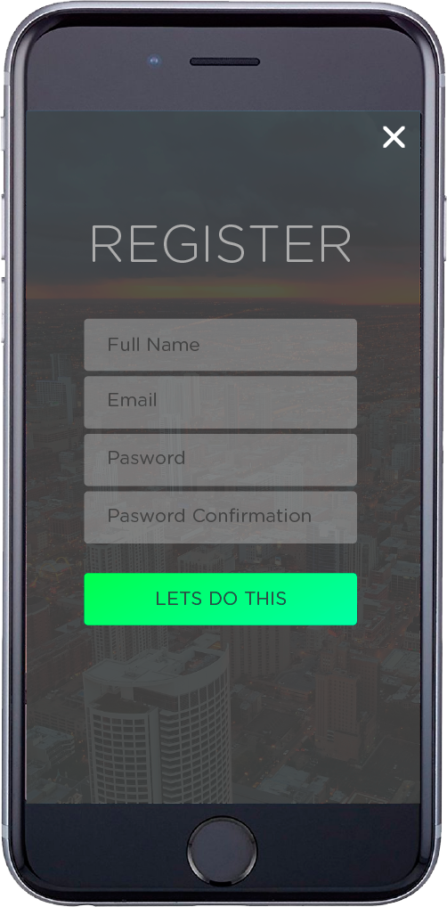
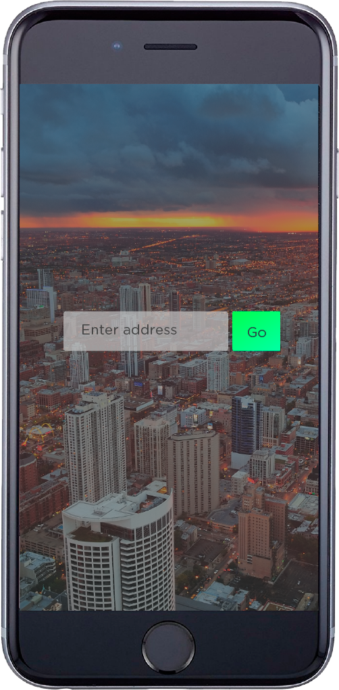
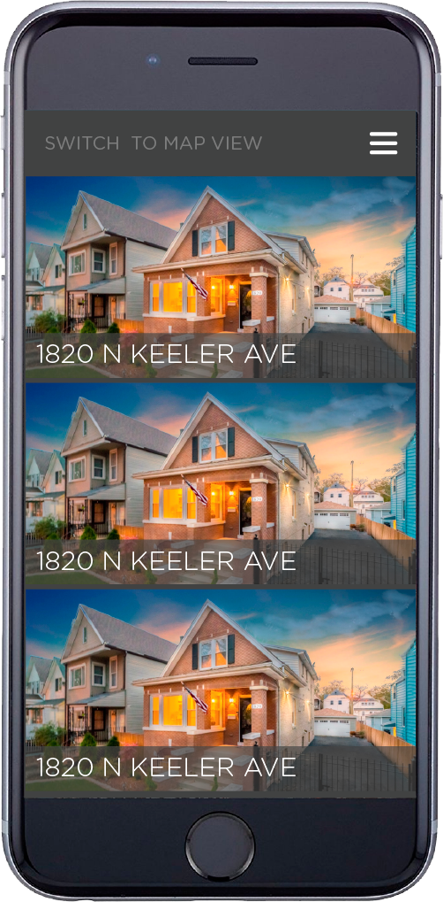
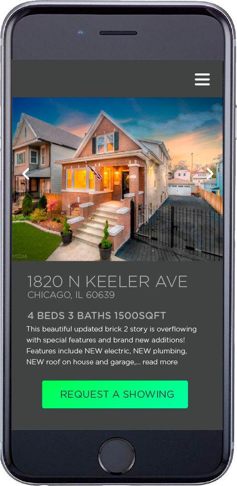
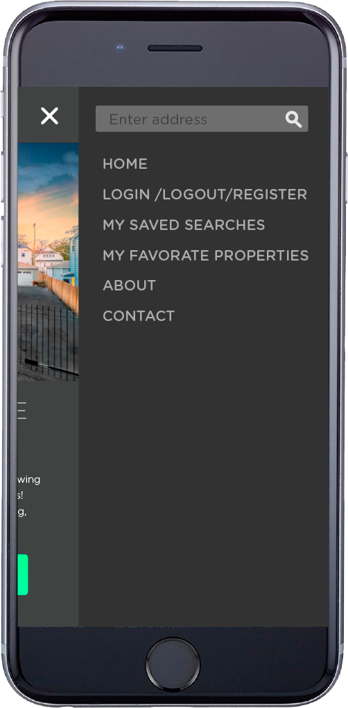

## What problem does it solve
Provides an interface for customer and agent interaction.

## User Stories
* User should be able to create an account
* User should be able to log in to the application
* User (client) should be able to search for a property based on a zip code query 
* User (client) should be able to request a showing of the chosen * property 
* User (agent) should be able to view requested showings 
* User (agent) should be able to reject or accept showing requests

## Wireframes

	
<h3>Log In</h1>

	
<h3>Register</h1>

	
<h3>Search</h1>

	
<h3>List of properties</h1>

	
<h3>Individual property</h1>

	
<h3>Mobile Menu</h1>

## Technologies Used

## reuirements for install/use

## upcoming features

## about the app 
Creates mutual trust between client and agent
Allows clients to search for a property within the agents working areas.
Simplifies the process of finding homes the user is interested in by working directly with the agent. 
Allows clients to send a request for a property showing.
Allows clients to send a request for purchase of chosen property.
